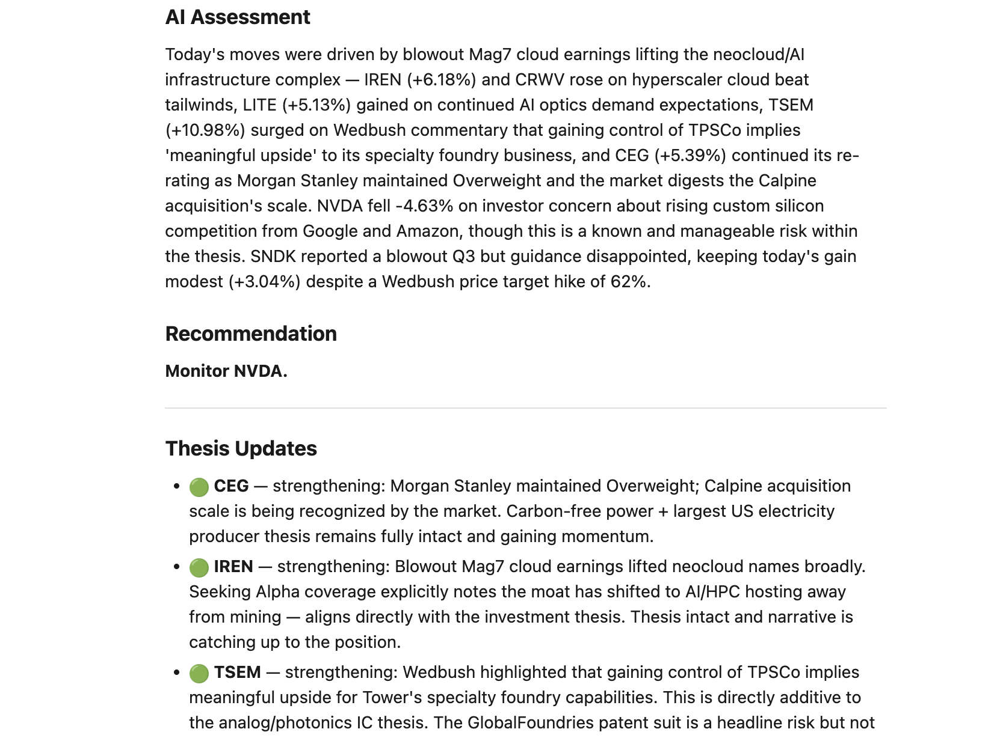

# Sheet Advisor

Most investment tools assume you already know what you're doing. Sheet Advisor starts one step earlier.

You bring a thesis — a conviction about where the world is going, a sector you believe in, a trend you want to bet on. Claude helps you turn that into a concrete strategy: specific positions, target weights, a written rationale for each holding, and rules for when to act and when to stay put. Then Sheet Advisor runs that strategy, with Claude watching it for you every day.

It's built for people who want to invest based on a real point of view, with an analyst who actually understands why they own what they own.

**Sheet Advisor is analysis-only.** It sends you alerts and rebalance suggestions, but it never places a trade. You decide what to act on and execute through your own brokerage. More on this [below](#placing-trades).

> ⚠️ **Not financial advice.** Sheet Advisor is a monitoring tool, not a financial advisor. Nothing it produces constitutes investment advice or a recommendation to buy or sell any security. Use at your own risk.

---

## The workflow

**Step 1 — Develop your strategy with Claude.**
Go to [claude.ai](https://claude.ai), share your investment thesis, and ask Claude to build a Sheet Advisor strategy from it. Claude will help you think through position sizing, suggest specific tickers that fit your thesis, write a rationale for each holding, and produce a finished strategy file ready to deploy. See [Building your strategy with Claude](#building-your-strategy-with-claude) below.

**Step 2 — Deploy it to Google Sheets in ~15 minutes.**
Clone this repo, point it at a blank Google Sheet, push the code with clasp, and run `setupSheet()`. Your Sheet is fully configured — positions, weights, dashboard, monitoring log — all from your strategy file. See [Setup](#setup-15-minutes) below.

**Step 3 — Get a daily briefing.**
Every day at market close, Sheet Advisor fetches prices, calculates your portfolio state, and calls Claude to assess what happened. Claude knows your thesis for every position, so it can tell the difference between a 5% drop that's noise and a 5% drop that means something. You get a daily email and a weekly digest. When something needs attention, you log into your brokerage and act on it yourself.

---

## What's in the daily email

- Portfolio value and daily change per investor
- Per-position daily move, sorted by biggest mover
- AI assessment — all clear, flag, or action needed — with specific reasoning
- Top mover with relevant news headlines (pulled automatically for big moves)
- Rebalance suggestions if any position has drifted significantly from its target weight

## What's in the weekly digest

- Weekly return and compound performance
- Best and worst day of the week
- Per-ticker weekly breakdown
- A deeper AI read: patterns, thesis drift, anything worth watching before next week

---

## Building your strategy with Claude

The strategy markdown file defines your positions, your thesis for each one, your target weights, and the rules Claude uses when assessing your portfolio. You don't have to write it from scratch.

Go to [claude.ai](https://claude.ai) and paste this prompt:

```
I want to set up Sheet Advisor, a portfolio monitoring system that uses the Claude API
to analyze my portfolio daily. It reads from a strategy markdown file with this structure:

- ## Overview — the investment thesis in plain text
- ## Investors — a table of names, amounts, and buy dates
- ## Positions — a table of tickers, companies, buckets (themes), target weights, buy prices, and a thesis for each position
- ## Cash — target cash reserve weight and reason for holding it
- ## Buckets — thematic groupings with colors and target weights
- ## Management Style — how active/passive, rebalance triggers, exit/trim/add criteria
- ## Settings Defaults — run time, timezone, alert thresholds
- ## Rebalancing Rules — plain-text rules Claude follows when assessing the portfolio

Here is my thesis: [describe your investment idea, the sectors or trends you want to
bet on, your risk tolerance, time horizon, and any specific companies or ETFs you
already have in mind]

Please help me develop this into a complete investment strategy and produce the full
strategy markdown file ready to use with Sheet Advisor.
```

Claude will ask clarifying questions, help you think through position sizing, suggest tickers that fit your thesis, and produce a finished markdown file you can drop straight into the `strategies/` folder.

Once your strategy is built, come back here and follow the setup steps below.

---

## Architecture

```
┌─────────────────────────────────────────────────────────────┐
│                     Google Apps Script                       │
│                     (runs daily at 5pm)                      │
│                                                             │
│  ┌──────────────┐   ┌───────────────┐   ┌────────────────┐  │
│  │ Google       │   │ Yahoo Finance │   │ Google         │  │
│  │ Sheets       │──▶│ API           │   │ Google         │  │
│  │ (prices via  │   │ (fallback for │   │ News RSS       │  │
│  │ GOOGLEFINANCE│   │ missing ticks)│   │ (headlines for │  │
│  │ + settings + │   └───────────────┘   │ big movers)    │  │
│  │ positions)   │            │          └────────────────┘  │
│  └──────────────┘            └────────┬─────────┘            │
│          │                           │                       │
│          └──────────────┬────────────┘                       │
│                         ▼                                    │
│                ┌─────────────────┐                           │
│                │   Claude API    │                           │
│                │ (AI assessment, │                           │
│                │  flags, thesis  │                           │
│                │  analysis)      │                           │
│                └────────┬────────┘                           │
│                         │                                    │
│            ┌────────────┴────────────┐                       │
│            ▼                         ▼                       │
│   ┌─────────────────┐      ┌──────────────────┐              │
│   │  Google Sheets  │      │  Gmail           │              │
│   │  (monitoring    │      │  (daily summary  │              │
│   │   log entry)    │      │   + weekly digest│              │
│   └─────────────────┘      └──────────────────┘              │
└─────────────────────────────────────────────────────────────┘
```

**Price source priority:** Sheet Advisor first reads live prices from `GOOGLEFINANCE()` formulas in your Dashboard tab. If a ticker isn't available there (e.g. a recent IPO), it falls back to Yahoo Finance's unofficial API. See the [Yahoo Finance note](#yahoo-finance-note) below.

---

## Cost estimate

| Component | Cost |
|-----------|------|
| Claude API — daily runs (~20/month) | ~$0.36/month |
| Claude API — weekly deep runs (~4/month) | ~$0.16/month |
| Google Sheets + Apps Script | Free |
| Yahoo Finance fallback | Free (unofficial API) |
| **Total** | **~$0.50–$1.50/month** |

Cost scales with portfolio size — more positions means longer prompts. A portfolio with 15–20 positions stays well under $2/month. All API usage is billed directly to your own Anthropic account at [console.anthropic.com](https://console.anthropic.com).

AI analysis is **optional**. Set `AI Enabled: false` in your Settings tab to run in mechanical-only mode at zero API cost.

---

## Prerequisites

- A **Google account** (for Sheets and Apps Script)
- An **Anthropic API key** — get one at [console.anthropic.com](https://console.anthropic.com)
- **Node.js** — `brew install node` on Mac, or download at [nodejs.org](https://nodejs.org)
- **clasp** — `npm install -g @google/clasp`

---

## Setup (~15 minutes)

### 1. Create a blank Google Sheet

1. Go to [sheets.google.com](https://sheets.google.com) and create a new blank spreadsheet
2. Name it anything you like (e.g. "My Portfolio")
3. Open the Apps Script editor: **Extensions → Apps Script**
4. **Copy your Script ID** from the URL — it's the long string between `/projects/` and `/edit`:
   ```
   https://script.google.com/home/projects/YOUR_SCRIPT_ID_IS_HERE/edit
   ```

### 2. Clone this repo and install

```bash
git clone https://github.com/mmignano/sheet-advisor.git
cd sheet-advisor
npm install
```

### 3. Configure `.clasp.json`

Open `.clasp.json` and replace the placeholder with your Script ID from Step 1:

```json
{
  "scriptId": "YOUR_SCRIPT_ID_HERE",
  "rootDir": "src"
}
```

> **Important:** After adding your Script ID, run `git update-index --skip-worktree .clasp.json` so git never accidentally commits your real Script ID. The repo keeps a placeholder for others to fill in.

### 4. Log in to clasp

```bash
clasp login
```

This opens a browser window for Google authentication. Sign in with the same Google account that owns the Sheet you created in Step 1.

### 5. Write your strategy

Open `strategies/strategy-example.md`. This file defines your entire strategy — positions, thesis for each one, target weights, investor names, and settings.

Edit it directly, or copy it to a new file:
```bash
cp strategies/strategy-example.md strategies/my-strategy.md
```

**What to fill in:**

| Section | What to do |
|---------|-----------|
| `## Investors` | Replace Alice/Bob with your real names and investment amounts |
| `## Positions` | Replace example tickers with your actual holdings. Set `Buy Price` to `null` — Sheet Advisor will auto-fill it on your first run |
| `## Cash` | Set your target cash reserve and why you're holding it |
| `## Settings Defaults` | Set your `Daily Run Time` (default `17:00`), `Timezone`, and alert thresholds |
| `## Rebalancing Rules` | Tell Claude how you want it to think about your portfolio — what to flag, what to ignore |

Target weights across all positions + cash must sum to 100%.

### 6. Build and push

Build `StrategyConfig.js` from your strategy markdown, then push all files to Apps Script:

```bash
# If you edited strategy-example.md:
npm run push

# If you created your own file:
node scripts/build-strategy.js strategies/my-strategy.md && clasp push
```

You should see something like:
```
> sheet-advisor@1.0.0 push
> npm run build-strategy && clasp push

Generated src/StrategyConfig.js from strategies/strategy-example.md
└─ src/appsscript.json
└─ src/ClaudeAnalyst.js
...
Pushed 11 files.
```

### 7. Initialize your Sheet

1. Go back to your Apps Script editor at [script.google.com](https://script.google.com)
2. Select **`setupSheet`** from the function dropdown at the top
3. Click **Run**

   > First run will show a permissions dialog. Click **Review permissions → Allow**. Sheet Advisor needs access to your Spreadsheet and the ability to send email from your account.

4. Open your Google Sheet — you should see 5 tabs: **Dashboard**, **Positions**, **Settings**, **Monitoring Log**, and **Rebalance History**, all populated from your strategy file.

### 8. Add your Anthropic API key

1. In the Apps Script editor, click the **⚙️ gear icon** (Project Settings) in the left sidebar
2. Scroll down to **Script Properties**
3. Click **Add script property**
4. Set the property name to `CLAUDE_API_KEY` and paste your Anthropic API key as the value
5. Click **Save script properties**

### 9. Set the daily trigger

1. Select **`setupTriggers`** from the function dropdown
2. Click **Run**
3. Click the **🕐 alarm clock icon** (Triggers) in the left sidebar to confirm you see a `dailyRun` trigger set to **5pm** in your timezone

**That's it.** Sheet Advisor will run for the first time at 5pm today (if you're before 5pm in your timezone) or tomorrow evening.

### 10. Test it (optional but recommended)

To verify everything is wired up before the first scheduled run:

1. Open the **Monitoring Log** tab — if there are any existing rows, delete them
2. Back in Apps Script, select **`testRun`** from the function dropdown and click **Run**
3. Watch the Execution Log for any errors
4. Check your inbox — you should receive a daily summary email within a minute or two

---

## Updating your strategy

Any time you change positions, weights, or settings in your strategy markdown file:

```bash
# Rebuild and push
npm run push

# Then re-run setupSheet() in the Apps Script editor
# (your Monitoring Log history is preserved)
```

You can also edit the **Settings** tab directly in the Sheet for quick changes (thresholds, enable/disable AI, etc.) — those take effect on the next run without a code push. But position and investor changes always flow through the markdown file → `npm run push` → `setupSheet()`.

---

## Sheet structure

| Tab | Purpose |
|-----|---------|
| **Dashboard** | Live portfolio view with `GOOGLEFINANCE()` prices. What you look at day-to-day. |
| **Positions** | Source of truth — tickers, weights, theses. Auto-populated from your strategy file. |
| **Settings** | All configuration — thresholds, schedule, investors, AI prompts, enable/disable switches. |
| **Monitoring Log** | Historical record — one row per daily run with AI assessments, daily changes, and flags. |
| **Rebalance History** | Trade log — populate this when you make trades using `logTradeManual()` in Apps Script. |

---

## What the daily email looks like



---

## Troubleshooting

**`clasp push` says "Project contents must include a manifest file"**
Your local repo is missing `src/appsscript.json`. Run `clasp pull` first to sync remote files, then `clasp push` again.

**Script ID placeholder not replaced / `clasp push` targets the wrong project**
Open `.clasp.json` and confirm `scriptId` is your real Script ID (not `YOUR_SCRIPT_ID_HERE`). Get it from the Apps Script URL: the long string between `/projects/` and `/edit`.

**`clasp login` signed into the wrong Google account**
Run `clasp logout`, then `clasp login` again and sign in with the account that owns the Sheet.

**Permissions dialog appeared and you clicked "Cancel"**
Go back to Apps Script, run `setupSheet()` again, and this time click **Review permissions → Allow**. Sheet Advisor needs Spreadsheet access and the ability to send email from your account.

**Daily trigger shows `NaN:00` in the execution log**
Google Sheets auto-converts time cell values to Date objects. Make sure you're on the latest version of Sheet Advisor (`git pull && npm run push`), which handles this correctly. Then re-run `setupTriggers()`.

**Emails show 0% change for every position**
Your trigger is firing before market close. Go to your Settings tab and confirm `Daily Run Time` is set to `17:00` (5pm) or later in your timezone, then re-run `setupTriggers()`.

**`Auth failed` or `HTTP 4xx` in the execution log**
Yahoo Finance's unofficial API (used as a fallback for tickers `GOOGLEFINANCE()` doesn't cover) has broken. For most US equities, this fallback is never needed. Check [GitHub issues](https://github.com/mmignano/sheet-advisor/issues) — a fix typically appears quickly.

**No email received after `testRun()`**
Check the Apps Script execution log for errors. Confirm your Anthropic API key is set correctly under Project Settings → Script Properties → `CLAUDE_API_KEY`. Also check your spam folder.

---

## Placing trades

Sheet Advisor is analysis-only. It never connects to a brokerage, never places an order, and never moves money. When Claude flags something or suggests a rebalance, you decide what to do and execute the trade yourself through your brokerage.

Because Sheet Advisor tracks positions as target weight percentages rather than fixed share counts, it works best with a brokerage that supports fractional shares. That way you can deploy capital to match your target weights without needing to round to whole shares. Fidelity, Schwab, and Robinhood all support fractional shares for most US equities.

---

## Yahoo Finance note

Sheet Advisor uses Yahoo Finance's unofficial API as a fallback price source for tickers that `GOOGLEFINANCE()` doesn't cover (e.g. very recent IPOs). **This API is not officially supported by Yahoo** and has broken multiple times as Yahoo changes their authentication mechanism to block scrapers.

If you see `Auth failed` or `HTTP 4xx` errors in your Apps Script execution log, the Yahoo fallback is the likely cause. For the vast majority of US equities and major international stocks, `GOOGLEFINANCE()` covers everything and the fallback is never needed.

When the Yahoo fallback breaks, check the [GitHub issues](https://github.com/mmignano/sheet-advisor/issues) — a fix typically appears quickly.

---

## Contributing

Bug reports and fixes are welcome — open an issue or pull request. For new features, **please open an issue first** to discuss before writing code. This keeps the codebase manageable and avoids effort on features that won't be merged.

---

## License

MIT — see [LICENSE](LICENSE).
